<h1 align="center"> <strong> :rocket: 30 days of CSS :rocket:  </strong></h1>

### :bookmark_tabs: Sobre o Desafio
Desafio criar 30 projetos simples utilizando as ferramentas tecnológicas HTML e CSS puro durante o período de 30 dias 
visando melhorar as habilidades de codificação.

### :dart: Objetivos
 - Realizar um projeto por dia durante o periodo de 27/10/2020 a 25/11/2020
 - Compartilhe o progresso no Github e LinkedIn com a hashtag #30daysOfCSS
 - O projeto deve ser concluído até 23:59

---

<h3 align="center"><strong>:heavy_check_mark: DESAFIO 1: AO PASSAR O MOUSE ALTERA O TEXTO NO BOTÃO</strong></h3>

  

--- 

<h3 align="center"><strong>:heavy_check_mark: DESAFIO 2: CUBO 3D COM ICONES DE REDES SOCIAIS </strong></h3>

  

--- 

<h3 align="center"><strong>:heavy_check_mark: DESAFIO 3: EFEITO DA GOTA DE CHUVA CAINDO NO MAR</strong></h3>

  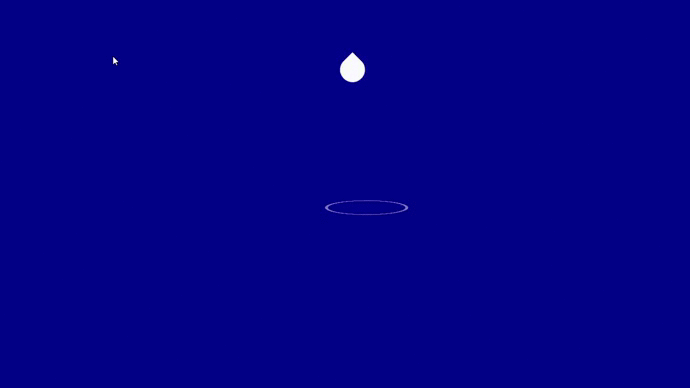

--- 

<h3 align="center"><strong>:heavy_check_mark: DESAFIO 4: HEXAGONAL COM ICONES DE REDES SOCIAIS</strong></h3>

  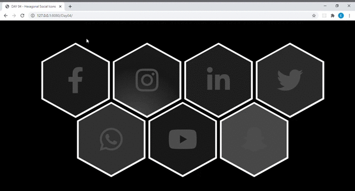

--- 

<h3 align="center"><strong>:heavy_check_mark: DESAFIO 5: CARD ROTACIONAL COM ICONE </strong></h3>

  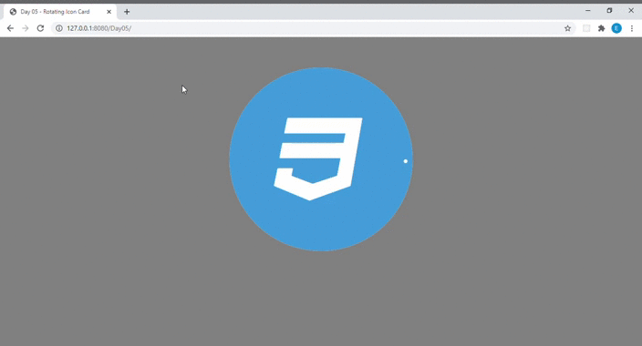

--- 

<h3 align="center"><strong>:heavy_check_mark: DESAFIO 6: AO PASSAR O MOUSE ALTERA O ÍCONE DE HAMBURGUER PARA O ICONE DE FECHAMENTO</strong></h3>

  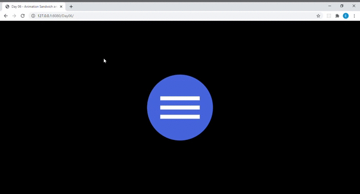

--- 

<h3 align="center"><strong>:heavy_check_mark: DESAFIO 7: CARDS ISOMÉTRICOS</strong></h3>
  

  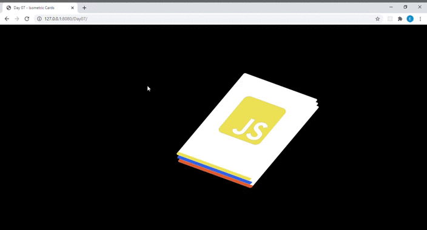

--- 

<h3 align="center"><strong>:heavy_check_mark: DESAFIO 8: ESCOLHER O ICONE DE REDE SOCIAL</strong></h3>

  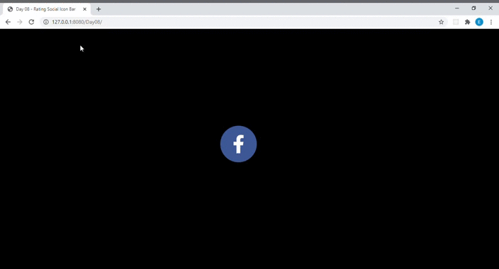

--- 

<h3 align="center"><strong>:heavy_check_mark: DESAFIO 9: FOGUEIRA</strong></h3>

  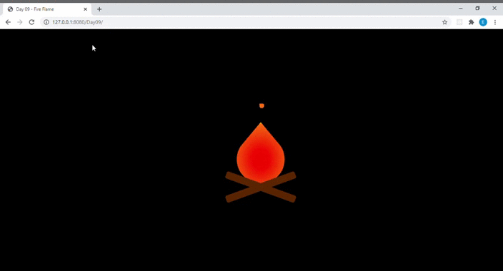

--- 

<h3 align="center"><strong>:heavy_check_mark: DESAFIO 10: SLIDER COM ICONES</strong></h3>

  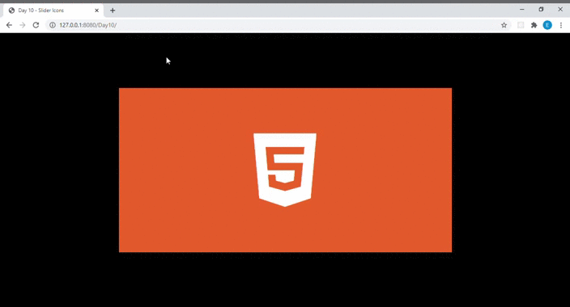

--- 

<h3 align="center"><strong>:heavy_check_mark: DESAFIO 11: EDIÇÃO DE TEXTO NO PAPEL</strong></h3>

  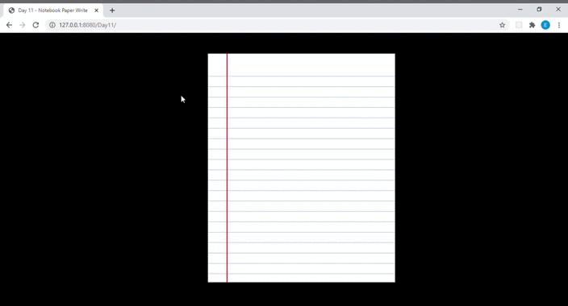

--- 

<h3 align="center"><strong>:heavy_check_mark: DESAFIO 12: BONECO DE NEVE</strong></h3>

  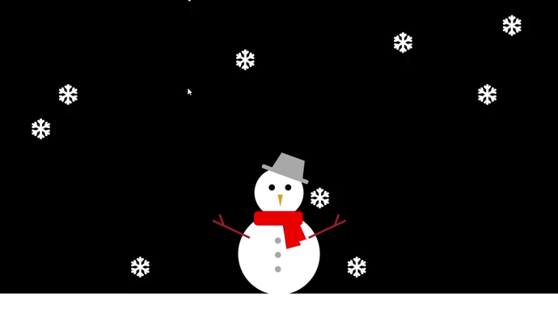

--- 

<h3 align="center"><strong>:heavy_check_mark: DESAFIO 13: DIA E NOITE</strong></h3>

  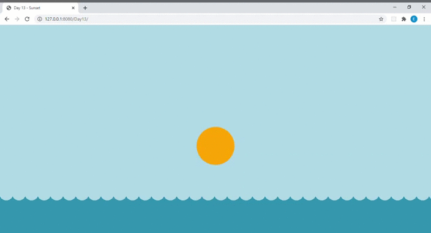

--- 

<h3 align="center"><strong>:heavy_check_mark: DESAFIO 14: RADIAL COM ÍCONE</strong></h3>

  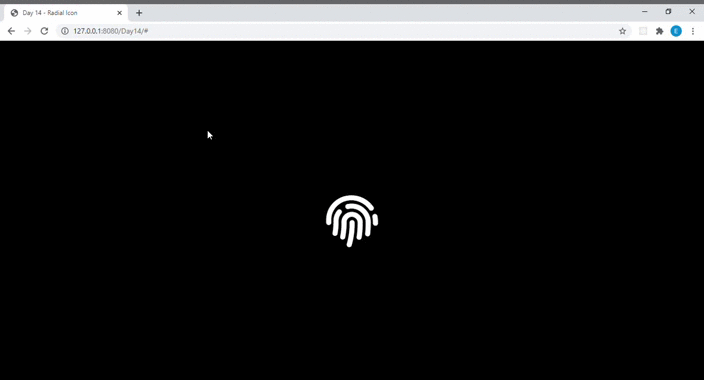

--- 

<h3 align="center"><strong>:heavy_check_mark: DESAFIO 15: SPINNER ANIMADO COM FORMAS REDONDAS</strong></h3>

  

--- 

<h3 align="center"><strong>:heavy_check_mark: DESAFIO 16: WIFI LOADING</strong></h3>

  

--- 

<h3 align="center"><strong>:heavy_check_mark: DESAFIO 17: TEXTO ANIMADO</strong></h3>

  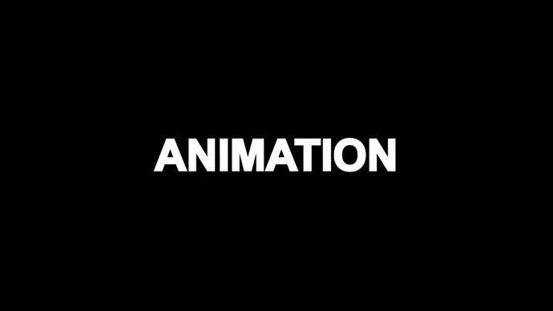

--- 

<h3 align="center"><strong>:heavy_check_mark: DESAFIO 18: INPUT COM ÍCONES DE REDES SOCIAIS</strong></h3>

  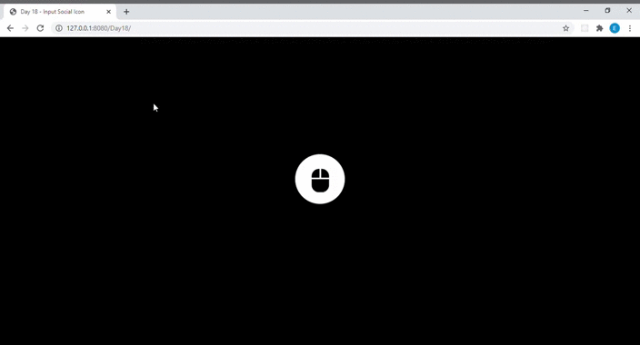

--- 

<h3 align="center"><strong>:heavy_check_mark: DESAFIO 19: LOADING COM ÍCONES DE REDES SOCIAIS</strong></h3>

  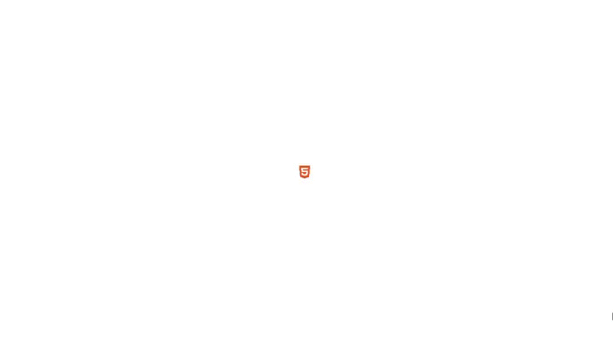

